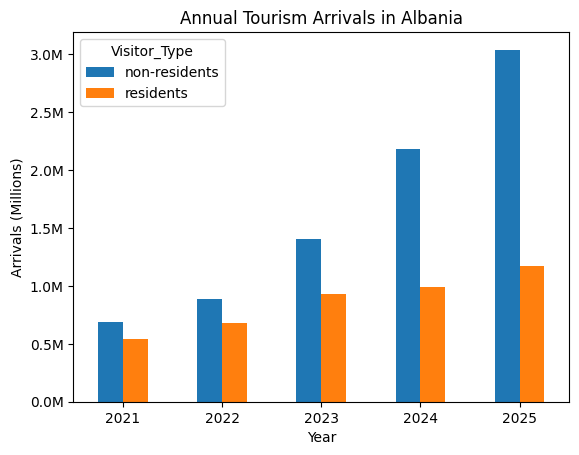
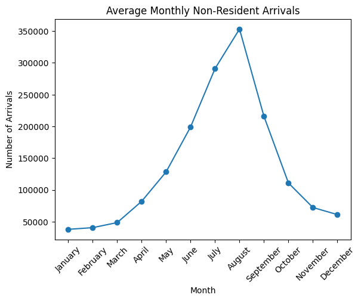
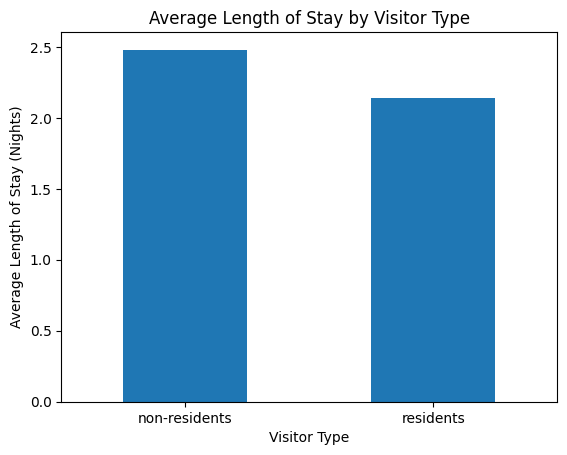

# Albania's Tourism Analytics

## Project Overview

This project analyzes tourism trends in Albania using official monthly tourism data from the Albanian Institute of Statistics (INSTAT).

The analysis focuses on visitor arrivals, nights spent, seasonal tourism patterns, and average length of stay for resident and non-resident visitors. Python and Pandas were used to clean, transform, and analyze the data. SQLite and SQL were used for additional analysis, and Matplotlib was used to create visualizations of major tourism trends.

## Data Source

The data used in this project comes from the Albanian Institute of Statistics (INSTAT), Albania's official statistical agency.

The dataset contains monthly tourism statistics covering January 2021 through June 2026.

The analysis includes:

- Total visitor arrivals
- Resident visitor arrivals
- Non-resident visitor arrivals
- Total nights spent
- Nights spent by residents
- Nights spent by non-residents

Source: [INSTAT Tourism Statistics](https://www.instat.gov.al/en/themes/industry-trade-and-services/tourism-statistics/)

## Tools & Technologies

- Python
- Pandas
- Matplotlib
- SQLite
- SQL
- PyCharm
- Git
- GitHub

## Data Cleaning and Preparation

The original INSTAT data was provided in Excel format and required cleaning and restructuring before analysis.

Using Python and Pandas, I:

- Loaded the original Excel datasets
- Cleaned and standardized column names
- Reshaped the monthly data from wide to long format using `melt()`
- Standardized resident and non-resident visitor categories
- Converted monthly values into a consistent date format
- Combined visitor arrivals with nights spent
- Calculated average length of stay
- Exported the cleaned data to CSV
- Loaded the final dataset into a SQLite database

The final combined dataset contains 198 records covering monthly tourism activity from January 2021 through June 2026.

## Analysis

The project analyzes:

- Total arrivals by visitor type
- Total nights spent by visitor type
- Average length of stay
- Annual tourism growth
- Monthly tourism seasonality
- Peak tourism months
- Resident and non-resident tourism patterns

SQL was also used to analyze the processed dataset and compare results with the Python analysis.

## Key Findings

### Non-Resident Tourism Growth

Non-resident visitor arrivals increased substantially between 2021 and 2025:

- 2021: 685,081
- 2022: 886,515
- 2023: 1,409,327
- 2024: 2,185,093
- 2025: 3,039,712

The 2026 data covers only January through June, so it is not directly compared with the completed calendar years.

### Visitor Composition

Across the full dataset:

- Non-residents accounted for approximately 66.15% of visitor arrivals.
- Residents accounted for approximately 33.85% of visitor arrivals.
- Non-residents accounted for approximately 69.35% of total nights spent.
- Residents accounted for approximately 30.65% of total nights spent.

### Average Length of Stay

Average length of stay was calculated by dividing total nights spent by total arrivals:

- Non-residents: approximately 2.48 nights
- Residents: approximately 2.14 nights

Non-resident visitors stayed longer on average than resident visitors.

### Tourism Seasonality

The monthly analysis shows a strong seasonal pattern, with tourism activity increasing during the summer months.

The highest single month for non-resident arrivals in the dataset was **August 2025**, with **650,108 arrivals**.

## Visualizations

### Annual Tourism Arrivals



This chart compares annual resident and non-resident visitor arrivals. Only complete calendar years from 2021 through 2025 are included so partial 2026 data does not affect the comparison.

### Monthly Tourism Seasonality



This chart shows average monthly non-resident arrivals using complete calendar years from 2021 through 2025. It highlights the increase in tourism activity during the summer months.

### Average Length of Stay



This chart compares the average length of stay for resident and non-resident visitors.

## SQL Analysis

The processed tourism dataset was loaded into a SQLite database for additional analysis.

SQL queries were used to examine:

- Total arrivals by visitor type
- Total nights spent by visitor type
- Average length of stay
- Peak non-resident tourism month
- Annual non-resident arrivals
- Previous year arrival comparisons using the `LAG()` window function

The SQL queries are available in:

`sql/analysis_queries.sql`

## Project Structure

```text
albania-tourism-analytics/
│
├── data/
│   ├── cleaned_monthly_arrivals.csv
│   ├── cleaned_monthly_nights_spent.csv
│   └── tourism_monthly_analysis.csv
│
├── images/
│   ├── annual_tourism_arrivals.png
│   ├── average_length_of_stay.png
│   └── monthly_tourism_seasonality.png
│
├── sql/
│   └── analysis_queries.sql
│
├── src/
│   ├── analyze_tourism.py
│   ├── clean_monthly_arrivals.py
│   ├── clean_monthly_nights_spent.py
│   ├── combine_data.py
│   └── create_database.py
│
├── tourism_analysis.db
├── README.md
└── requirements.txt
```

## Skills Demonstrated

This project demonstrates experience with:

- Python data analysis
- Pandas data cleaning and transformation
- Excel and CSV data
- Reshaping data from wide to long format
- Combining multiple datasets
- Date and time series analysis
- Creating calculated metrics
- Exploratory data analysis
- Data visualization with Matplotlib
- SQLite database creation
- SQL aggregation and filtering
- Common Table Expressions (CTEs)
- SQL window functions
- Comparing analytical results across Python and SQL
- Git and GitHub
- Organizing a reproducible data analytics project

## How to Run

1. Clone the repository.
2. Install the packages listed in `requirements.txt`.
3. Run `clean_monthly_arrivals.py` to clean the arrivals data.
4. Run `clean_monthly_nights_spent.py` to clean the nights-spent data.
5. Run `combine_data.py` to create the combined analysis dataset.
6. Run `create_database.py` to create the SQLite database.
7. Run `analyze_tourism.py` to reproduce the analysis and visualizations.
8. Review `sql/analysis_queries.sql` for the SQL analysis.

## Author

Andrea Bulli